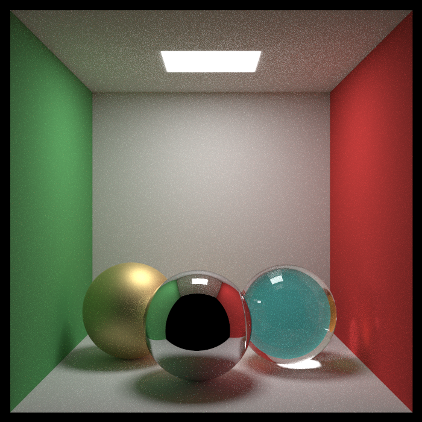
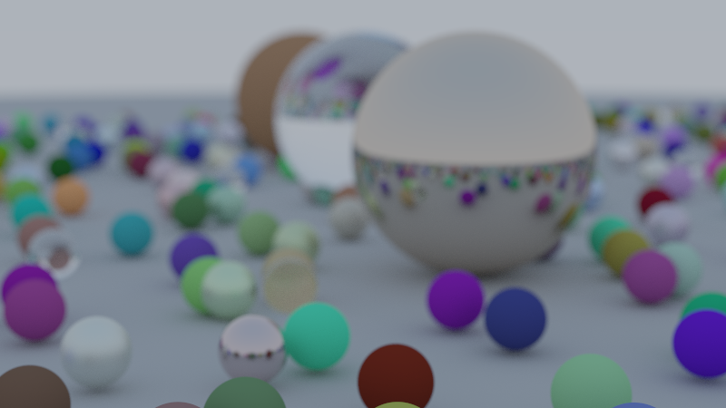
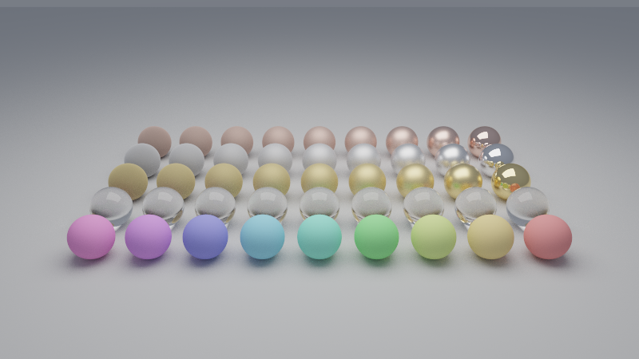
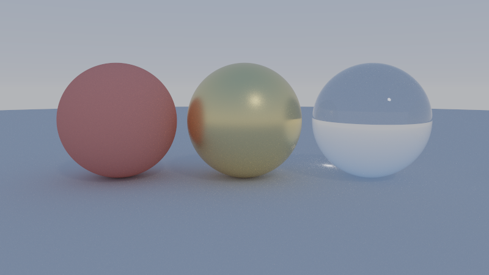
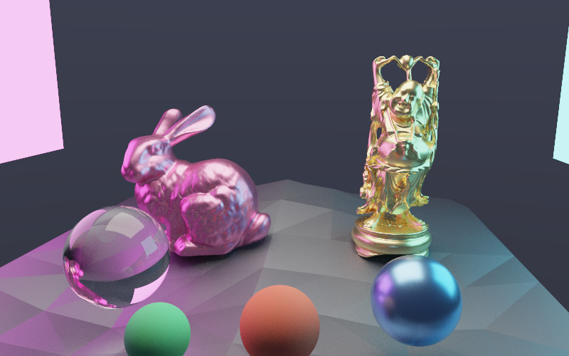
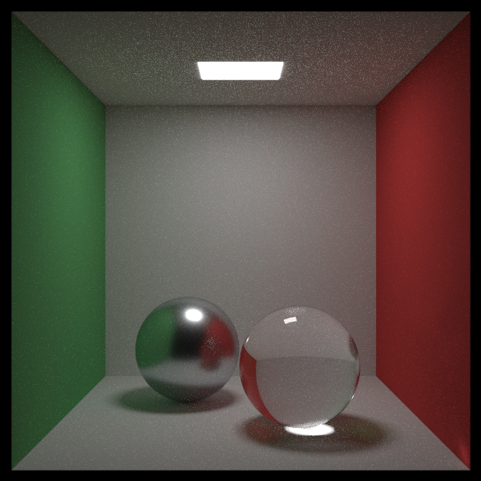
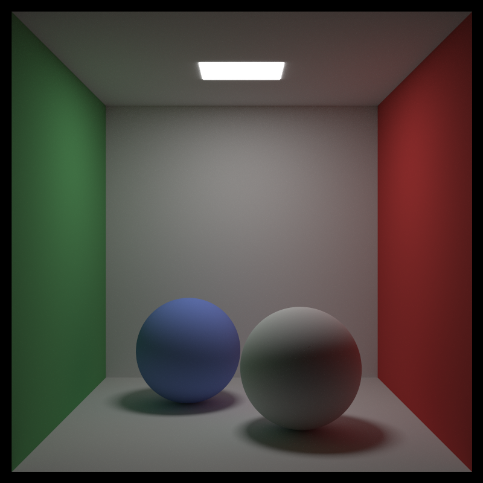

# Prime

A headless, physically based **path tracer** written in Rust.

Prime renders scenes by Monte-Carlo path tracing: it shoots rays from a camera,
bounces them around a scene of geometry and materials, and accumulates the light
that reaches the eye. Output is a PNG. There is no GUI and no GPU dependency —
it builds and runs anywhere `cargo` does.

```
prime cornell -o cornell.png --width 800 --height 800 --samples 256
```

| Scene | Command |
|-------|---------|
| Material showcase — glass, mirror, GGX metals, diffuse (default) | `prime showcase` |
| Material studio — area-lit GGX roughness sweep + glass/diffuse | `prime studio` |
| "Ray Tracing in One Weekend" — ~485 random spheres | `prime rtweekend` |
| Procedural-sky IBL with a sun (directional shadows) | `prime sky` |
| Textured checker floor under a sky | `prime textured` |
| Any scene under an HDR environment | `prime studio --env sky.hdr` |
| Cornell box (global illumination) | `prime cornell` |
| Sphere field under a sky (defocus blur) | `prime spheres` |
| Vibrant bunny + buddha (per-group materials, colored lights) | `prime assets/bunny_buddha.ron` |
| Custom scene from a file | `prime myscene.ron` |
| A bare mesh, auto-framed | `prime model.obj` |
| **Interactive viewer in the browser** | `prime-serve` → open http://127.0.0.1:8080 |

---

## Gallery

All rendered by Prime itself (built-in scenes; commands above).

<table>
<tr>
<td align="center" width="50%"><br><b>showcase</b> — glass, mirror &amp; GGX metals under one area light (default)</td>
<td align="center" width="50%"><br><b>rtweekend</b> — ~485 random spheres (diffuse / metal / glass)</td>
</tr>
<tr>
<td align="center"><br><b>studio</b> — GGX roughness sweep, plus glass &amp; diffuse rows</td>
<td align="center"><br><b>sky</b> — procedural-sky image-based lighting with a sun</td>
</tr>
<tr>
<td align="center"><br><b>bunny + buddha</b> — OBJ meshes, per-group materials, colored area lights</td>
<td align="center"><br><b>cornell</b> — the classic global-illumination box</td>
</tr>
</table>

---

## Why this exists / what changed

Prime began as a ~5,700-line Java 1.7 renderer with a Swing + JOGL (OpenGL)
scene editor. That original code lives on in git history at the **`java-final`**
tag (`git checkout java-final`). It was rebuilt from scratch in Rust with a focus
on **a clean, headless, testable architecture**. The most important changes:

| Concern | Legacy (Java) | Now (Rust) |
|--------|----------------|------------|
| Entry point | 1,292-line `MainGui` god class (Swing/JOGL, IO, render loop, dialogs all in one) | A pure `prime-core` library + a thin `prime` CLI |
| Math types | Mutable `Vec3f`/`Color3f` with public fields and shared mutable `ZERO`/`UNIT_*` singletons | Immutable `Copy` `Vec3`; no aliasing hazards, **zero heap allocation** in hot loops |
| Materials | Abstract base + subclasses, transmission never implemented, unused microfacet stub, dead BRDF branches | Sealed `enum Material`: Lambertian, **GGX microfacet** Metal, **Dielectric** (real refraction), Emissive — exhaustively checked, no virtual dispatch |
| Acceleration | kd-tree whose traversal mutated the ray's length to prune | Binned-SAH **BVH** in a flat node array, iterative stack traversal, cross-checked against brute force |
| Parallelism | A fresh `ExecutorService` leaked on every render | Rayon over the global pool; deterministic per-pixel RNG (reproducible images) |
| Scene I/O | Java `Serializable` + `ObjectOutputStream` (fragile, unsafe) | Human-readable **RON** scene files via Serde |
| Asset loading | OBJ loader coupled to the GUI (`new ContentLoader(mainGui)`) | Pure `obj::load(path, …) -> Result<Vec<Triangle>, ObjError>` |
| Dependencies | log4j 1.2.17, commons-collections 3.2.1 (CVEs), JOGL 2.1.2 (dead `javax.media.opengl`) | A small set of current, audited crates |
| Tests | None | Unit tests across math, geometry, BVH, materials, camera, color, OBJ, scene |

---

## Architecture

A Cargo workspace with three crates:

```
crates/
  prime-core/   # the renderer as a pure library (no windowing, no image codec)
  prime-cli/    # the `prime` binary: argument parsing, PNG output, progress bar
  prime-serve/  # the `prime-serve` binary: an interactive web viewer
  prime-cuda/   # the `prime-gpu` binary: experimental CUDA renderer (excluded
                # from the workspace; needs an NVIDIA GPU + CUDA toolkit)
```

Both front-ends are thin shells over `prime-core`. The library knows nothing
about PNGs, HTTP, or argument parsing — exactly the decoupling the legacy
GUI-coupled design lacked.

### `prime-core` modules

```
math/        Vec3 (immutable Copy), orthonormal basis, Monte-Carlo sampling
ray          origin + direction
aabb         axis-aligned box + slab test
geometry/    Sphere, Triangle (Möller–Trumbore), sealed `Primitive` enum
bvh          binned-SAH bounding volume hierarchy, iterative traversal
hit          intersection record (point, oriented normal, uv, material id)
material     sealed BSDF enum: Lambertian / GGX Metal / Dielectric / Emissive
sampler      low-discrepancy sampling: Owen-scrambled Sobol (Burley 2020)
env          image-based lighting: equirect HDR env map, importance-sampled
texture      constant / checker / image textures (bilinear, sRGB); normal maps
camera       thin-lens pinhole camera (look-at, fov, optional defocus)
scene        material table + BVH + light list + camera config + background
integrator   parallel path tracer: next-event estimation + MIS, quasi-Monte
             -Carlo sampling, firefly clamp, Russian roulette
framebuffer  linear HDR pixel buffer -> sRGB bytes
color        tonemapping (clamp / Reinhard) + gamma
obj          Wavefront OBJ loader (no UI dependency)
desc         serializable `SceneDesc` (RON) -> `Scene`
demo         built-in scenes: showcase, studio, rtweekend, sky, textured, Cornell, spheres
```

### Pipeline

`Scene` (materials + `Bvh<Primitive>` + `CameraConfig` + `Background`) →
`integrator::render` (Rayon-parallel over scanlines, iterative path tracing) →
`Framebuffer` (linear HDR) → `color::to_srgb8` → PNG.

---

## Build & run

Requires a recent stable Rust toolchain (1.96+).

```bash
cargo build --release          # build everything
cargo test                     # run the unit tests
cargo run --release -- cornell -o out/cornell.png --samples 256
```

### CLI options

```
prime [SCENE] [OPTIONS]

SCENE                     built-in (showcase, studio, rtweekend, sky, textured,
                          cornell, spheres), .ron, or .obj  [default: showcase]
-o, --output <FILE>       output PNG                           [default: out.png]
-w, --width  <N>          image width                          [default: 800]
    --height <N>          image height                         [default: 450]
-s, --samples <N>         samples per pixel                    [default: 64]
-d, --depth <N>           max bounce depth                     [default: 32]
    --seed <N>            RNG seed (reproducible)              [default: 0]
-j, --threads <N>         worker threads                       [default: all cores]
    --tonemap <T>         clamp | reinhard                     [default: clamp]
    --gamma <F>           display gamma                        [default: 2.2]
    --clamp <F>           firefly clamp; 0 disables (unbiased) [default: 0]
    --no-qmc              use white-noise instead of QMC sampling
    --env <FILE.hdr>      equirectangular HDR environment (image-based lighting)
    --env-intensity <F>   scale env radiance                    [default: 1.0]
    --env-rotation <DEG>  spin the env about the vertical axis  [default: 0]
```

---

## Interactive web viewer

`prime-serve` renders a scene **progressively** on a background thread and
streams the accumulating image to a browser. Drag to orbit, scroll to zoom, and
tweak quality/tonemap/resolution live — every change restarts accumulation and
the image refines while idle.

```bash
cargo run --release -p prime-serve -- cornell --width 720 --height 540
# then open http://127.0.0.1:8080
```

```
prime-serve [SCENE] [OPTIONS]

SCENE                       built-in name, .ron, or .obj          [default: cornell]
    --addr <ADDR>           bind address                          [default: 127.0.0.1]
-p, --port <N>              port                                  [default: 8080]
-w, --width / --height      render resolution                    [default: 640x400]
-d, --depth <N>             max bounce depth                      [default: 12]
    --samples-per-pass <N>  samples added per progressive pass    [default: 2]
    --target-spp <N>        stop accumulating at this many spp    [default: 1024]
    --tonemap <T>           clamp | reinhard                      [default: reinhard]
    --gamma <F>             display gamma                         [default: 2.2]
```

Design: a single render thread owns all mutable state (scene, orbit camera,
accumulation buffer) and is driven by commands from the HTTP handlers over a
channel; handlers only read the latest published frame under a mutex. The
renderer never locks on its hot path, and data races are structurally
impossible. Endpoints: `GET /` (page), `GET /frame.png`, `GET /status`,
`POST /camera`, `POST /settings`, `POST /scene`.

---

## GPU renderer (experimental)

An in-progress CUDA backend (`prime-cuda` → the `prime-gpu` binary) that runs the
renderer on an NVIDIA GPU. Kernels are compiled at runtime with NVRTC (via
[`cudarc`](https://crates.io/crates/cudarc)) — no build-time `nvcc` step — and
the result is read back and written to a PNG, so it is fully headless and its
output can be diffed against the CPU renderer (the reference).

It needs an NVIDIA GPU + CUDA toolkit, so it is **excluded from the Cargo
workspace and CI**. Build and run it explicitly:

```bash
CUDA_PATH=/usr/local/cuda \
  cargo run --manifest-path crates/prime-cuda/Cargo.toml --release -- \
  cornell --samples 1024 --output out/gpu.png --validate
```

**Status — Phase C (increment 2):** a GPU **path tracer** with **next-event
estimation + MIS**. The scene's BVH, primitives, material table, and light list
are uploaded; the kernel reuses the validated Phase-B traversal and adds shading
+ direct light sampling (Lambertian + emissive, Russian roulette). The GPU uses
plain white-noise sampling (not the CPU's QMC), but both are unbiased estimators
of the same rendering equation, so the GPU image **converges to the CPU
reference**: on the diffuse Cornell box, `--validate` reports RMSE falling
**2.6% → 1.5% → 0.9%** at 64 / 256 / 1024 spp (the 1/√spp decay — noise, not
bias; NEE reaches at 256 spp what the pure path tracer needed ~4k spp for). And
it's **~150× faster than the single-threaded CPU** at equal samples on an RTX 5090.

Next increments: GGX metal & dielectric (so the full Cornell renders), then
textures + environment lighting.

<p align="center"><br><i>Path-traced on the GPU (RTX 5090): the diffuse Cornell box, converged to the CPU reference.</i></p>

---

## Scene format

Scenes are plain data in [RON](https://github.com/ron-rs/ron). Objects reference
materials by index. Meshes are loaded from OBJ paths relative to the scene file.
See [`assets/demo.ron`](assets/demo.ron) for a complete example:

```ron
(
    camera: ( look_from: (x: 0.0, y: 1.4, z: 6.5), look_at: (x: 0.0, y: 0.7, z: 0.0),
              vup: (x: 0.0, y: 1.0, z: 0.0), vfov: 45.0, aperture: 0.05, focus_dist: Some(6.5) ),
    background: Gradient( bottom: (x: 1.0, y: 1.0, z: 1.0), top: (x: 0.5, y: 0.7, z: 1.0) ),
    // A material's albedo is a Texture: Constant, Checker, or Image. A
    // Lambertian/Metal may also carry a tangent-space `normal` map (srgb: false).
    materials: [
        Lambertian(albedo: Constant((x: 0.5, y: 0.5, z: 0.5))),
        Lambertian(albedo: Checker(even: (x: 0.9, y: 0.9, z: 0.9), odd: (x: 0.1, y: 0.1, z: 0.1), scale: 8.0)),
        Lambertian(albedo: Image(path: "wood.png", srgb: true)),
        Lambertian(albedo: Image(path: "brick.png", srgb: true), normal: Some(Image(path: "brick_n.png", srgb: false))),
        Metal(albedo: Constant((x: 0.85, y: 0.85, z: 0.88)), roughness: 0.1),
        Dielectric(ior: 1.5),
        Emissive(emit: (x: 8.0, y: 6.5, z: 5.0)),
    ],
    objects: [
        Sphere(center: (x: 0.0, y: 1.0, z: 0.0), radius: 1.0, material: 1),
        Mesh(path: "scene.obj", material: 0, transform: Some((scale: 1.0, translate: (x: 0.0, y: 0.0, z: 0.0)))),
        // Load just one OBJ group, so a multi-object file can use several materials:
        Mesh(path: "scene.obj", material: 2, group: Some("bunny.obj")),
    ],
)
```

See [`assets/bunny_buddha.ron`](assets/bunny_buddha.ron) for a full multi-light
scene that loads each group of `scene.obj` with its own material.

---

## Performance

On a 28-core machine (release build):

* Cornell box, 800×800, 256 spp (glass + metal, deep bounces): **~3.3 s**
* Stanford Bunny + Happy Buddha (`assets/scene.obj`, 169,794 triangles),
  800×600, 64 spp: **~0.4 s**

Renders are deterministic: the same `--seed`, dimensions, and sample count
produce a byte-identical image regardless of thread count.

---

## License

MIT.
